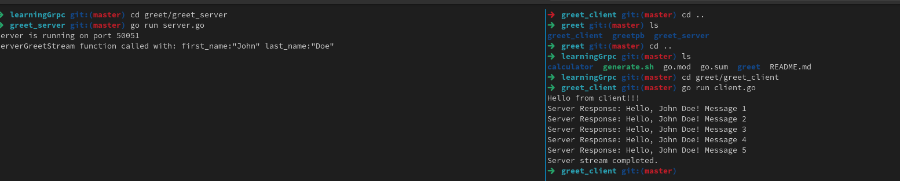

# Learning gRPC

This repository contains a project for learning gRPC and building services using Protocol Buffers and Go.

## Project Structure

- `greet/`: Contains the greeting service (`greet.proto`) and generated code.
- `calculator/`: Contains the calculator service (`calculator.proto`) and generated code.
- `generate.sh`: A shell script for generating Go code from `.proto` files using `protoc`.
- `go.mod`: Go module file for dependency management.
- `server.go`: gRPC server implementation.
- `client.go`: gRPC client implementation.

## Prerequisites

Before running the project, make sure you have the following installed:

- Go (preferably version 1.16+)
- `protoc` (Protocol Buffers Compiler)
- `protoc-gen-go` (Go plugin for protoc)
- `protoc-gen-go-grpc` (Go plugin for gRPC)

To install the necessary tools, run the following:

```bash
go install google.golang.org/protobuf/cmd/protoc-gen-go@latest
go install google.golang.org/grpc/cmd/protoc-gen-go-grpc@latest
```

## 📖 Learn More About gRPC  

### 🔹 Official gRPC Documentation  
- [gRPC Core Concepts](https://grpc.io/docs/what-is-grpc/core-concepts/)  
- [gRPC Quickstart Guide](https://grpc.io/docs/languages/)  
- [gRPC Best Practices](https://grpc.io/docs/guides/performance/)  

### 🔹 Video Tutorials 
- [What is gRPC](<https://www.youtube.com/watch?v=hVrwuMnCtok>) 
- [Introduction to RPC - Remote Procedure Calls](<https://www.youtube.com/watch?v=eRndYq8iTio>)  


## How to Run the Project

### Step 1: Clone the repository

```bash
git clone git@github.com:NikeshSapkota01/learningGrpc.git
```

### Step 2: Navigate to the project folder

```bash
cd learningGrpc
```

### Step 3: Tidy up the Go module

```bash
go mod tidy
```

### Step 4: Start the gRPC server

```bash
cd greet/greet_server
go run server.go
```

### Step 5: Run the gRPC client in a new terminal window

```bash
cd greet/greet_client
go run client.go
```

### Output(something like this)

